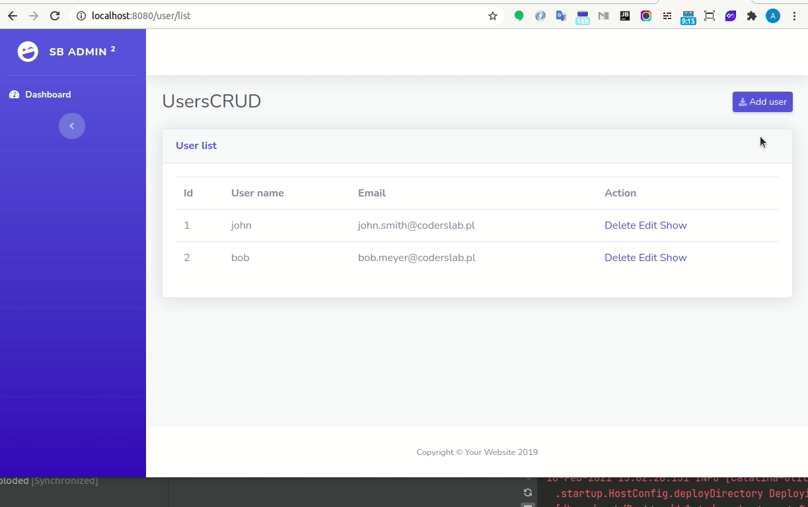

MY CODE IS HERE: https://github.com/JanKocabek/users-crud-students/tree/master/jankocabek

# User Dao

## Introduction to the UsersCRUD workshop

As you know, the aim of today's workshop is to create a web app that will allow you to manage users: UsersCRUD.

Data to power your program will be downloaded from the MySQL database. You will use the classes User and UserDao created during the previous workshop.

Example of interaction with the program:

## What will you learn in this workshop?

Workshop in the form of one big task of preparing one larger program certainly gives a big shot of practical knowledge and allows you to move faster and more confidently around the Java code, Servlets, MVC, and the IntelliJ program.

This project uses practically all the things that were presented and discussed during this module such as:

* MVC,
* Servlets,
* OOP,
* MySQL,
* DAO classes,
* Maven.

All of them will be used for this project! That will certainly consolidate your knowledge.
